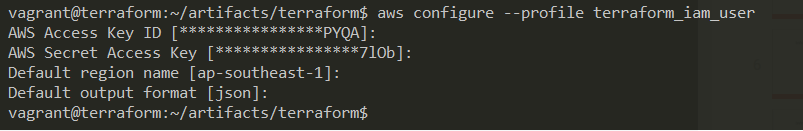
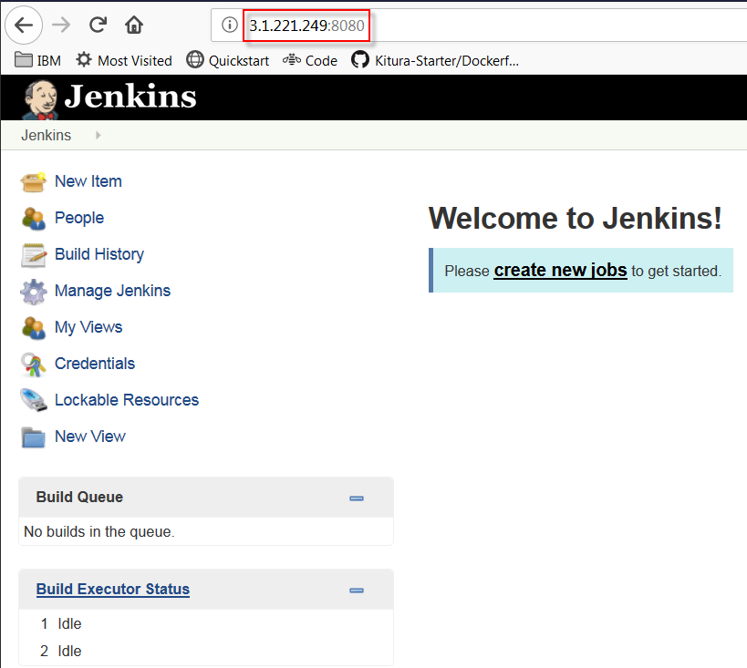

# Building Repeatable Infrastructure with Terraform and Ansible on AWS

Many companies are still struggling with basic IT operations. They spend too much time putting out fires and manually building, configuring and maintaining infrastructure resulting in a considerable loss of capital that could have helped with the transformation of their company. I'm not saying that they should stop investing in IT operations, far from that but suggesting better planning could go a long way; you should consider spending more time developing your product than caring about the infrastructure and servers.  This blog post is aimed at shedding some light and recommend a plan moving forward with Disposable Infrastructure in a destructive and fast pace world.

Your ability to quickly build and dispose of your cloud infrastructure solutions will define how agile your business will be tomorrow. Digital transformation fuels and empowers rapid innovation and growth; this is it the way forward to remain relevant in an ever-changing world. Now, image if you could move at a higher velocity as you grow and evolve your infrastructure. I think this is possible with Disposable Infrastructure!

Embracing cloud solutions can drive business performance, cash flow, and other associated benefits. On top of that, you are no longer vendor lock-in you choose what makes more sense for your company while remaining flexible. Having to wait weeks or months for new infrastructure is not longer an option; as a result of that it easier to drive revolutionizing business outcomes.

Disposable Infrastructure is not another soup du jour and before you know fades in the constant IT buzz, the cloud is here to stay, whether you like it or not. To remain innovative and move ahead, you need cloud technology that seamlessly integrates multi-cloud initiatives. With that, you can achieve great things when you embrace Cloud technology and when you combine great tools and collaborate — adopting cloud and automation tools immediately lower barriers for making changes to infrastructure with the ability to scale to many types of clouds and manage heterogeneous information systems. This blog post suggested AWS (Amazon Web Services), but the same applies to the other Cloud providers, such as IBM, Microsoft, Google Cloud, DigitalOcean, Salesforce.com to name a few; but by far AWS is the most popular cloud infrastructure provider out there in addition to offering a generous **[free tier](https://aws.amazon.com/free/)** which allows you to run all of these examples for free.

## Disposable Infrastructure

What is **"Disposable Infrastructure"** also known as **"Immutable Infrastructure"**; Disposable Infrastructure is the process of _"Automating the process of provisioning, configuring, deploying, and tearing down cloud infrastructure and services."_;  whether you are dealing with development, staging, production, QA environments.

Often IT teams commonly struggle to keep their documentation relevant, useful, and accurate; using (IaC) **"Infrastructure as Code"** can help circumvent this constraint. Infrastructure as code is an approach that provides principles, practices, and patterns for using these technologies effectively with that you can increase your operational readiness, exponentially. The real strength of IaC is the process of managing IT infrastructure through definition files rather than interactive configuration tools combined with continuous integration and continuous delivery pipelines. The definition files are version controlled for better resource management and reproducibility. In the cloud world Infrastructure is broadly defined as code represented and composed of physical and virtual resources that support the flow, storage, processing, and analysis of data  that can rapidly deploy and scale applications; while in the real-world this is defined as Networks, Subnetworks, Firewalls, LoadBalancers, Storage, Public IPs, and DNS Entries. 

Infrastructure is composed of physical and virtual resources that support the flow, storage, processing, and analysis of data.


A high degree of automation can be achieved as shown by these use cases for Repeatable Infrastructure:
- Dymanic infrastructure
- Repeatable Processes (DevOps Automation)
- Self-Documented Systems and Processes
- Multi-Cloud Deployment
- Idempotent (making repeatedly REST API calls while producing the same result)
- Moving from stateful to stateless
- Scaling policy, reduce resources at night and scale back in the morning.
- Disposable Environments
- Resiliant platform
- Configuration Drift detection (avoid configuration drift at the infrastructure layer)
- Durability of data
- Software Defined Networking (SDN)
- Provision a new servers in minutes or seconds.


## Goals of Infrastructure as Code
IaC is about writing code that describes the infrastructure, similar to writing a program in a high-level language; it brings many benefits, and the most prevailing one is the dynamic infrastructure where resources can easily be created, destroyed, replaced, resized, and moved. Systems are designed to assume that the infrastructure will always be changing.  Based on the reproducibility principle where any action carried out on the infrastructure should be repeatable, fostering the culture of scripting and configuration management tools rather than manually making configuration changes or using one-off scripts to make infrastructure adjustments. The operations of infrastructure are managed instead of using the same rules and structures that govern code development—particularly when new server instances are spun up. Here are a few tangible benefits from adopting IaC:
- Adapt faster to changes and provide business value on-demand
- Build repeatable environments quickly, with little effort. (infrastructure documentation is always up to date, keeping a detailed audit trail for changes); with that, your infrastructure documentation is coupled with its implementation; thus, you can achieve:
	- Reproducibility
	- Disposability
	- Accessibility
	- Policy as Code (Cloud Governance)
	- Discipline
	- Idempotency
	- Scalability
- Tolerant to failure with dynamic infrastructure (effortlessly destroy and rebuild servers, most notably between dev and ops.)

## What is Terraform?

Terraform is a multi-cloud (IaC) Infrastructure as Code software by HashiCorp written in Go Language using (HCL) HashiCorp Config Language. An open source command line tool that can be used to provide an infrastructure on many different platforms and services such as IBM, AWS, GCP, Azure, OpenStack, VMware and more. By using a plugin-based model to support providers and provisioners, giving it the ability to support almost any service that exposes APIs. It is a cloud-agnostic tool that elegantly defines your IaC, simple and yet powerful; Terraform allows you to build complex, version controlled, collaborative, heterogeneous and disposable systems with very high productivity. It provides built-in dependencies between each tier that handle automatic provisioning of infrastructure, both in the public and private cloud.

## What is Ansible?

Ansible is an open-source software provisioning, (CM) Configuration Management, and application deployment, provisioning, and deployment tool acquired by Red Hat in 2015. It provides the ability through declarative language to describe system configuration; it uses YAML (YAML Ain’t Markup Language) a human-readable data serialization language syntax for expressing Ansible Playbooks. Ansible Playbooks are the building blocks for all the use cases of Ansible. Ansible uses SSH, with no agents to install on remote systems.  

## How to use Ansible with Terraform?

Leveraging Automation for a Disposable Infrastructure by making the right choice, let's understand the difference between  (IaC ) Infrastructure as Code **"Terraform"** and (CM) Configuration Management **"Ansible"** and how to use both Terraform and Ansible to provision an environment. Terraform lacks a native provisioning plug-in for Ansible, but it does not matter, we will show you a workaround to circumvent the challenge by using **local-exec** and **remote-exec** built-in provisioners.

Terraform is excellent at managing cloud services below the server. While its strength is with the provisioning of infrastructure at scale, it is excellent for the initial server setup, primarily infrastructure while delegating configuration tasks to Ansible; Ansible is a lot easier to configure for software setup. Terraform is excellent for the provision of the infrastructure. Once in place then use Ansible to achieve the goals of an automated enterprise—through complimentary security, image management, post provisioning configuration, and integrated end to end automation solutions. The diagram below depicts a scenario where it uses Terraform to provision the infrastructure and Ansible for configuration management all on AWS Cloud.

Terraform is used to create, manage, and manipulate infrastructure resources. Examples of resources include physical machines, VMs, network switches, containers, etc. Almost any infrastructure noun can be represented as a resource in Terraform.

- Terraform will provision infrastructure like EC2 instances,  Security Goups, ELB and VPC into AWS IaC
- Ansible will deploy/test application on EC2 instance as CM like Jenkins and GitLab


**FIGURE 1: Server Provisioning with Terraform and Ansible.**

Few things to know before diving in for each to the software used:

- **Terraform**
  - Infrastructure scaffolding (logical "environment", servers, network, storage, etc.)
  - Inbuilt state management (tracks the state of your infrastructure and the impact)
  - Declarative style execution (code that specifies your desired end state)
  - Does not rollback on failure (if some part of your deployment fails unfortunately it does not know how to roll back the changes).
  - Maintains the version history of the infrastructure
  - Use a client-only architecture

- **Ansible**
  - Procedural describes an application that requires the exact steps to be laid out in the code. 
  - It’s procedural language (step-by-step) application using YMAL
  - Deploy once and you are done, unless you run it again and the outcome is Idempotent
  - It's agent-less and uses SSH communication
  - Use a client-only architecture


Let's dive into the details and actualize the scenario: dynamic infrastructure must be treated as a first class citizen in any cloud project; you can deploy the same infrastructure in development, test and production environments; the sizing can be parameterize.

With IaC to provisioning infrastructure using scripts/tools instead of manually configuring machines.
Simple words:

- Provisioning the full life-cycle management by running `terraform apply`
  - Creating: resources with a plus sign (+) are going to be created <span style="color:green"> **(in green)**</span>
  - Updating: resources with a tilde sign (~) are going to be modified <span style="color:orange"> **(in amber)**</span>
  - Deleting: resources with a minus sign (-) are going to be deleted <span style="color:red"> **(in red)**</span>

In the next section, more will be discussed around create, update and delete of resources, by applying `terraform plan` ,`terraform apply`  and `terraform destroy` and leveraging `ansible-playbook` (Ansible Playbooks to manage the life-cycle of the application).

## Setting up the environment:
This guide assumes that you already have some understanding of AWS and have a working account. The installation of Terraform and Ansible are straightforward, and the details are at this link.

### Prerequisites:

- [AWS CLI](https://github.com/ernesen/Terraform-Ansible/blob/master/artifacts/scripts/install_software.sh) (Install AWS CLI)
- [Terraform](https://github.com/ernesen/Terraform-Ansible/blob/master/artifacts/scripts/config_software.sh) (Install Terraform)
- [Ansible](https://github.com/ernesen/Terraform-Ansible/blob/master/artifacts/scripts/install_software.sh) (Install Ansible)

Spinning up an instance on AWS

- Open AWS Account
- Create IAM admin user (*terraform_iam_user*)

AWS has its deployment tool called CloudFormation, but my obvious choice is for a generic and Terraform for the part.

Have aws-cli installed and AWS configured with secret keys then run `aws configure --profile terraform_iam_user` (this is my account, you need to create your  secret key for this to work, in this example my key is <span style="color:grey">*terraform_iam_user*</span>)



**FIGURE 2: AWS credentials**

I have uploaded the source code to a GitHub repo at this [location](https://github.com/ernesen/Terraform-Ansible) for you to follow along should you see the need to put this to the test.

To summarize, we will be building the below components for you to follow along:
- Create AWS account
- Create AMI new user in AWS
- Configure AWS credentials (cat .aws/config)
    Have aws-cli installed and aws configured with secret keys
    A key pair for EC2 instances

### Defining SSH key-pair files

The SSH key-pair files defined here will be used in the Terraform to connect to the EC2 instances with this credential. Intentionally, all components use the same certificate  for ease of use, but you can have different ones if required.

```sh
$ ssh-keygen -t rsa -b 2048 -f ~/.ssh/MyKeyPair.pem -q -P ''
$ chmod 400 ~/.ssh/MyKeyPair.pem
$ ssh-keygen -y -f ~/.ssh/MyKeyPair.pem > ~/.ssh/MyKeyPair.pub
```

All the moving parts pertinent to the configuration are now settled for us to get started with the implementation.

## Let's get started:

This blog post attempts to share some of my understanding of Cloud, and its underlayer, along with the process I hope to hear your point of view and how is the cloud helping you with your infrastructure. I wish to convey the best practice and convey the salient points to the right audience. As you follow the various steps in this blog post, you will be presented with the challenges that I've come across and shed light on the approach and the reasoning behind the decisions. 


Lets get our hands dirty. Installing Terraform, Ansible and the AWS CLI
Ideas like immutable infrastructure, repeatable processes, and deterministic results. 
For this blog post we are using Terraform for infrastructure, Ansible for provisioning and AWS for hosting


### local-exec and remote-exec:

These two built in provisioners local-exec and remote-exec are required for Ansible to work in Terraform, as Terraform lacks the necessary native plug-ins. This is the workaround to invoke Ansible within the local-exec provisioner. That requires to **configure** the connection with the host,  user, and private_key, see resource.tf for more details.

#### remote-exec

Python is required for Ansible to work, by using the "**remote-exec**" it makes sure that Python is installed before it's possible to invoke "**local-exec**"; the snippet of code is extracted from resources.tf file.

```yaml
  # Ansible requires Python to be installed on the remote machine as well as the local machine.
  provisioner "remote-exec" {
    inline = ["sudo apt-get -qq install python -y"]
  }
  
  connection {
    private_key = "${file(var.private_key)}"
    user        = "ubuntu"
  } 
```
#### local-exec

For Ansible, you can first run the Terraform, and output the IP addresses, then run ansible-playbook on those hosts. The code snippets have been simplified.  The code snippet is extracted from the resources.tf file. Please refer to the code repository for the complete solution. 

```yaml
  # This is where we configure the instance with ansible-playbook
  # Jenkins requires Java to be installed 
  provisioner "local-exec" {
	command = <<EOT
      sleep 30;
	  >java.ini;
	  echo "[java]" | tee -a java.ini;
	  echo "${aws_instance.jenkins-ci.public_ip} ansible_user=${var.ansible_user} ansible_ssh_private_key_file=${var.private_key}" | tee -a java.ini;
      export ANSIBLE_HOST_KEY_CHECKING=False;
	  ansible-playbook -u ${var.ansible_user} --private-key ${var.private_key} -i java.ini ../playbooks/install_java.yaml
    EOT
  }
  
  # This is where we configure the instance with ansible-playbook
  provisioner "local-exec" {
	command = <<EOT
      sleep 30;
	  >jenkins-ci.ini;
	  echo "[jenkins-ci]" | tee -a jenkins-ci.ini;
	  echo "${aws_instance.jenkins-ci.public_ip} ansible_user=${var.ansible_user} ansible_ssh_private_key_file=${var.private_key}" | tee -a jenkins-ci.ini;
      export ANSIBLE_HOST_KEY_CHECKING=False;
	  ansible-playbook -u ${var.ansible_user} --private-key ${var.private_key} -i jenkins-ci.ini ../playbooks/install_jenkins.yaml
    EOT
  }
```

### Terraform declarative files

#### Define Terraform version

This file is not required; it's just a good practice for debugging if needed and it indicates on which version this code was built on.

[terraform.tf](https://raw.githubusercontent.com/ernesen/Terraform-Ansible/master/artifacts/terraform/terraform.tf)

```json
terraform {
  required_version = ">= 0.11.11"
}
```
#### Define AWS Provider
<span style="color:grey">*Each provider offers a set of named resource types, and defines for each resource type which arguments it accepts, which attributes it exports, and how changes to resources of that type are actually applied to remote APIs.*</span>[*](https://www.terraform.io/docs/configuration/providers.html)
Terraform has plug-ins for each provider, and we need to download it before going to work with any cloud with Terraform by issuing the following command `terraform init`  and it will download the necessary plug-ins for AWS.

[provider.tf](https://raw.githubusercontent.com/ernesen/Terraform-Ansible/master/artifacts/terraform/provider.tf)

```json
provider "aws" {
  region  = "${var.region}"
  profile = "${var.profile}"
}
```

#### Define AWS Resources
[resources.tf](https://raw.githubusercontent.com/ernesen/Terraform-Ansible/master/artifacts/terraform/resources.tf)
```json
resource "aws_key_pair" "tf_demo" {
  key_name   = "MyKeyPair"
  public_key = "${file(var.public_key)}"
}

resource "aws_instance" "jenkins-ci" {
  count = "${var.instance_count}"
  #ami = "${lookup(var.amis,var.region)}"
  ami = "${var.ami}"
  instance_type = "${var.instance}"
  key_name = "${aws_key_pair.tf_demo.key_name}"
  
  vpc_security_group_ids = [
	"${aws_security_group.web.id}", 
	"${aws_security_group.ssh.id}",
	"${aws_security_group.egress-tls.id}",
	"${aws_security_group.ping-ICMP.id}"
  ]
  
  connection {
    private_key = "${file(var.private_key)}"
    user        = "ubuntu"
  } 
  
  #user_data = "${file("../templates/install_jenkins.sh")}"

  # This approach is a hack ensuring the image it up and running before calling the "local-exec" command.
  provisioner "remote-exec" {
    inline = ["echo just checking for ssh in jenkins-ci instance. ttyl. bye."]
  }

  # This is where we configure the instance with ansible-playbook
  provisioner "local-exec" {
	command = <<EOT
      sleep 30;
	  >java.ini;
	  echo "[java]" | tee -a java.ini;
	  echo "${aws_instance.jenkins-ci.public_ip} ansible_user=${var.ansible_user} ansible_ssh_private_key_file=${var.private_key}" | tee -a java.ini;
      export ANSIBLE_HOST_KEY_CHECKING=False;
	  ansible-playbook -u ${var.ansible_user} --private-key ${var.private_key} -i java.ini ../playbooks/install_java.yaml
    EOT
  }
  
  # This is where we configure the instance with ansible-playbook
  provisioner "local-exec" {
	command = <<EOT
      sleep 30;
	  >jenkins-ci.ini;
	  echo "[jenkins-ci]" | tee -a jenkins-ci.ini;
	  echo "${aws_instance.jenkins-ci.public_ip} ansible_user=${var.ansible_user} ansible_ssh_private_key_file=${var.private_key}" | tee -a jenkins-ci.ini;
      export ANSIBLE_HOST_KEY_CHECKING=False;
	  ansible-playbook -u ${var.ansible_user} --private-key ${var.private_key} -i jenkins-ci.ini ../playbooks/install_jenkins.yaml
    EOT
  }
  tags {
    Name = "jenkins-ci-${count.index +1 }"
	Batch = "7AM"
	Location = "Singapore"
  }
}


resource "aws_instance" "gitLab" {
  count = "${var.instance_count}"
  #ami = "${lookup(var.amis,var.region)}"
  ami = "${var.ami}"
  instance_type = "${var.instance}"
  key_name = "${aws_key_pair.tf_demo.key_name}"
  
  vpc_security_group_ids = [
	"${aws_security_group.web.id}", 
	"${aws_security_group.ssh.id}",
	"${aws_security_group.egress-tls.id}",
	"${aws_security_group.ping-ICMP.id}"
  ]
  
  connection {
    private_key = "${file(var.private_key)}"
    user        = "ubuntu"
  } 
  
  #user_data = "${file("../templates/install_gitLab.sh")}"

  # This approach is a hack ensuring the image it up and running before calling the "local-exec" command.
  provisioner "remote-exec" {
    inline = ["echo just checking for ssh in gitLab instance. ttyl. bye."]
  }
  
  # This is where we configure the instance with ansible-playbook
  provisioner "local-exec" {
	command = <<EOT
      sleep 30;
	  >gitLab.ini;
	  echo "[gitLab]" | tee -a gitLab.ini;
	  echo "${aws_instance.gitLab.public_ip} ansible_user=${var.ansible_user} ansible_ssh_private_key_file=${var.private_key}" | tee -a gitLab.ini;
      export ANSIBLE_HOST_KEY_CHECKING=False;
	  ansible-playbook -u ${var.ansible_user} --private-key ${var.private_key} -i gitLab.ini ../playbooks/install_gitlab.yaml
    EOT
  }
  tags {
    Name = "gitLab-${count.index +1 }"
	Batch = "7AM"
	Location = "Singapore"
  }
}

resource "aws_security_group" "web" {
  name = "default-web-example"
  description = "Security group for web that allows web traffic from internet"
  #vpc_id = "${aws_vpc.default.id}"
  
  ingress {
    from_port = 80
    to_port   = 80
    protocol  = "tcp"
    cidr_blocks = ["0.0.0.0/0"]
  }

  ingress {
    from_port = 443
    to_port   = 443
    protocol  = "tcp"
    cidr_blocks = ["0.0.0.0/0"]
  }
  
  tags {
    Name = "web-example-default-vpc"
  }
}

resource "aws_security_group" "ssh" {
  name = "default-ssh-example"
  description = "Security group for nat instances that allows SSH and VPN traffic from internet"
  #vpc_id = "${aws_vpc.default.id}"
  
  ingress {
    from_port   = 22
    to_port     = 22
    protocol    = "tcp"
    cidr_blocks = ["0.0.0.0/0"]
  }
    
  tags {
    Name = "ssh-example-default-vpc"
  }
}

resource "aws_security_group" "egress-tls" {
  name = "default-egress-tls-example"
  description = "Default security group that allows inbound and outbound traffic from all instances in the VPC"
  #vpc_id = "${aws_vpc.default.id}"
  
  egress {
    from_port   = 0
	to_port     = 0
	protocol    = "-1"
	cidr_blocks = ["0.0.0.0/0"]
  }
  
  tags {
    Name = "egress-tls-example-default-vpc"
  }
}

resource "aws_security_group" "ping-ICMP" {
  name = "default-ping-example"
  description = "Default security group that allows to ping the instance"
  #vpc_id = "${aws_vpc.default.id}"
  
  ingress {
    from_port   = -1
    to_port     = -1
    protocol    = "icmp"
    cidr_blocks = ["0.0.0.0/0"]
    ipv6_cidr_blocks = ["::/0"]
  }
  
  tags {
    Name = "ping-ICMP-example-default-vpc"
  }
}
```

#### Define Terraform variables
[variables.tf](https://raw.githubusercontent.com/ernesen/Terraform-Ansible/master/artifacts/terraform/variables.tf)

```json
variable "profile" {
  default = "terraform_iam_user"
}

variable "region" {
  default = "ap-southeast-1"
}

variable "instance" {
  default = "t2.nano"
}

variable "instance_count" {
  default = "1"
}

variable "public_key" {
  default = "~/.ssh/MyKeyPair.pub"
}

variable "private_key" {
  default = "~/.ssh/MyKeyPair.pem"
}

variable "ansible_user" {
  default = "ubuntu"
}

variable "amis" {
  type = "map"
    default = {
    ap-northeast-1 = "ami-b25d44b3" # Asia Pacific (Tokyo)
    ap-southeast-1 = "ami-aeb49ffc" # Asia Pacific (Singapore)
    ap-southeast-2 = "ami-6b770351" # Asia Pacific (Sydney)
  }
}

variable "ami" {
  default = "ami-0c5199d385b432989"
}
```
#### Define Terraform Outputs

[outputs.tf](https://raw.githubusercontent.com/ernesen/Terraform-Ansible/master/artifacts/terraform/outputs.tf)

```json
output "url-jenkins" {
  value = "http://${aws_instance.jenkins-ci.0.public_ip}"
}

output "url-gitLab" {
  value = "http://${aws_instance.gitLab.0.public_ip}"
}
```

### Ansible declarative files
#### Install Java for Jenkins
##### Instructions:
- Install Oracle Java version 8
- Install dependencies
- Install add-apt-repostory
- Add Oracle Java Repository
- Add an apt key by id from a keyserver
- Accept Java 8 License
- Update cache and ignore errors in case of problems
- Purge java 8 installer - to avoid problems if installation is repeated
- Install Oracle Java 8

[install_java.yaml](https://raw.githubusercontent.com/ernesen/Terraform-Ansible/master/artifacts/playbooks/install_java.yaml)
```yaml
---
- name: Install Oracle Java version 8
  hosts: java
  become: true
  
  tasks:
  - name: Install dependencies
    become: yes
    apt:
      name: "{{ packages }}"  
    vars:
      packages:    
      - software-properties-common
      - dirmngr
      state: latest 
 
  - name: Install add-apt-repostory
    become: yes
    apt: name=software-properties-common state=latest
 
  - name: Add Oracle Java Repository
    become: yes
    apt_repository: 
      repo: deb http://ppa.launchpad.net/webupd8team/java/ubuntu trusty main
      state: present
 
  - name: Add an apt key by id from a keyserver
    become: yes
    apt_key:
      keyserver: keyserver.ubuntu.com
      id: EEA14886
 
  - name: Accept Java 8 License
    become: yes
    debconf: name='oracle-java8-installer' question='shared/accepted-oracle-license-v1-1' value='true' vtype='select'
 
  - name: update cache and ignore errors in case of problems
    become: yes
    apt: update_cache=yes
    ignore_errors: yes
 
  - name: purge java 8 installer - to avoid problems if installation is repeated
    become: yes
    apt: 
      name: oracle-java8-installer
      purge: yes
      state: absent
       
  - name: Install Oracle Java 8
    become: yes
    apt:
      name: "{{ packages }}"  
    vars:
      packages:    
      - ca-certificates
      - oracle-java8-installer
      - oracle-java8-set-default
      state: latest 
```
#### Install Jenkins
##### Instructions:
- Install Jenkins
- Ensure the jenkins apt repository key is installed
- Ensure the repository is configured
- Install Jenkins package
- Start & Enable Jenkins
- Sleep for 30 seconds and continue with play
- Get init password Jenkins
- Print init password Jenkins

[install_jenkins.yaml](https://raw.githubusercontent.com/ernesen/Terraform-Ansible/master/artifacts/playbooks/install_jenkins.yaml)
```yaml
---
- name: Install Jenkins
  hosts: jenkins-ci
  gather_facts: false
  become: true
  
  tasks:
    - name: Ensure the jenkins apt repository key is installed
      apt_key: 
        url: https://pkg.jenkins.io/debian-stable/jenkins.io.key
        state: present

    - name: Ensure the repository is configured
      apt_repository: 
        repo: deb https://pkg.jenkins.io/debian-stable binary/ 
        state: present

    - name: Install Jenkins
      apt:
        name: jenkins
        state: present

    - name: Start & Enable Jenkins
      service: 
        name: jenkins
        state: started

    - name: Sleep for 30 seconds and continue with play
      wait_for: 
        timeout: 30

    - name: Get init password Jenkins
      shell: cat /var/lib/jenkins/secrets/initialAdminPassword
      changed_when: false
      register: result

    - name: Print init password Jenkins
      debug:
        var: result.stdout
```
#### Install GitLab
##### Instructions:
- Install GitLab
- Checking to make sure postfix is installed
- Install GitLab repository
- Run GitLab repository script
- Install GitLab CE
- Run ufw allow http script 
- Run ufw allow https script
- Run ufw allow OpenSSH script
- Restart with reconfigure
- GitLab Restart with restart
- GitLab gitlab-runsvdir status

[install_gitlab.yaml](https://raw.githubusercontent.com/ernesen/Terraform-Ansible/master/artifacts/playbooks/install_gitLab.yaml)

```yaml
---
- name: Install GitLab
  hosts: gitLab
  become: true

  tasks:
    - name: Checking to make sure postfix is installed
      apt:
        name:
        - postfix
        - mailutils
        - ca-certificates
        - curl 
        - openssh-server
        state: present
      tags: [postfix]
      when: ansible_os_family == 'Debian'        
    
    - name: Install GitLab repository
      get_url:
        url: https://packages.gitlab.com/install/repositories/gitlab/gitlab-ce/script.deb.sh
        dest: /tmp/script.deb.sh
        mode: 0777
    
    - name: Run GitLab repository script
      shell: /tmp/script.deb.sh

    - name: Install GitLab CE
      package:
        name:    
        - gitlab-ce
        state: latest 
        update_cache: yes
      
    - name: Run ufw allow http script 
      command: ufw allow http

    - name: Run ufw allow https script 
      command: ufw allow https

    - name: Run ufw allow OpenSSH script 
      command: ufw allow OpenSSH
      
    - name: Restart with reconfigure
      command: gitlab-ctl reconfigure

    - name: GitLab Restart with restart
      command: gitlab-ctl restart

    - name: GitLab gitlab-runsvdir status
      command: service gitlab-runsvdir status
```

## Deploy application

Terraform has four essential commands that allow us to deal with an end-to-end workflow:

- terraform init

- terraform plan

- terraform apply

- terraform destroy

We’ll walk you through the entire process, step-by-step:

**1)** Download from https://github.com/ernesen/Terraform-Ansible.

```sh
$ git clone https://github.com/ernesen/Terraform-Ansible && cd Terraform-Ansible
```

**2)** Explore the directories and get yourself familiar with the code, go over each file and understand how they all work together (reserve 30 minutes for this exercise), make changes where you deem necessary:

```sh
vagrant@software:~/Terraform-Ansible$ tree
.
├── artifacts
│   ├── config
│   │   └── config_multi-nodes.yaml
│   ├── playbooks
│   │   ├── install_gitlab.yaml
│   │   ├── install_java.yaml
│   │   └── install_jenkins.yaml
│   ├── scripts
│   │   ├── config_software.sh
│   │   ├── install_software.sh
│   │   └── ssh_pass.sh
│   ├── templates
│   │   ├── install_busybox.sh
│   │   ├── install_jenkins.sh
│   │   ├── install_nginx.sh
│   │   └── user_data.sh
│   └── terraform
│       ├── outputs.tf
│       ├── provider.tf
│       ├── resources.tf
│       ├── terraform.tf
│       └── variables.tf
├── images
│   ├── aws_configure.png
│   ├── aws_terraform_ans v1.png
│   └── jenkins-ci.png
├── install.sh
├── README.md
└── Vagrantfile

```

**3)** Prepare the ssh key required (public and private keypair), issue the below commands:

```sh
$ ssh-keygen -t rsa -b 2048 -f ~/.ssh/MyKeyPair.pem -q -P ''
$ chmod 400 ~/.ssh/MyKeyPair.pem
$ ssh-keygen -y -f ~/.ssh/MyKeyPair.pem > ~/.ssh/MyKeyPair.pub
```

**4)** Prepare your profile key, make sure you have already created your AWS account

```sh
vagrant@software:~/Terraform-Ansible$ aws configure --profile terraform_iam_user
AWS Access Key ID [****************PYQA]:
AWS Secret Access Key [****************7lOb]:
Default region name [ap-southeast-1]:
Default output format [json]:
```

**5)** terraform init to download the necessary provider file:

```sh
vagrant@software:~/Terraform-Ansible$ cd artifacts/terraform/
vagrant@software:~/Terraform-Ansible/artifacts/terraform$ terraform init

Initializing provider plugins...
- Checking for available provider plugins on https://releases.hashicorp.com...
- Downloading plugin for provider "aws" (2.3.0)...

The following providers do not have any version constraints in configuration,
so the latest version was installed.

To prevent automatic upgrades to new major versions that may contain breaking
changes, it is recommended to add version = "..." constraints to the
corresponding provider blocks in configuration, with the constraint strings
suggested below.

* provider.aws: version = "~> 2.3"

Terraform has been successfully initialized!

You may now begin working with Terraform. Try running "terraform plan" to see
any changes that are required for your infrastructure. All Terraform commands
should now work.

If you ever set or change modules or backend configuration for Terraform,
rerun this command to reinitialize your working directory. If you forget, other
commands will detect it and remind you to do so if necessary.

```

**6)** terraform plan

```sh
vagrant@software:~/Terraform-Ansible/artifacts/terraform$ terraform plan
Refreshing Terraform state in-memory prior to plan...
The refreshed state will be used to calculate this plan, but will not be
persisted to local or remote state storage.


------------------------------------------------------------------------

An execution plan has been generated and is shown below.
Resource actions are indicated with the following symbols:
  + create

Terraform will perform the following actions:

  + aws_instance.gitLab
      id:                                                <computed>
      ami:                                               "ami-0c5199d385b432989"
      arn:                                               <computed>
      associate_public_ip_address:                       <computed>
      availability_zone:                                 <computed>
      cpu_core_count:                                    <computed>
      cpu_threads_per_core:                              <computed>
      ebs_block_device.#:                                "1"
      ebs_block_device.2671853018.delete_on_termination: "true"
      ebs_block_device.2671853018.device_name:           "/dev/sdg"
      ebs_block_device.2671853018.encrypted:             "true"
      ebs_block_device.2671853018.iops:                  "2000"
      ebs_block_device.2671853018.snapshot_id:           <computed>
      ebs_block_device.2671853018.volume_id:             <computed>
      ebs_block_device.2671853018.volume_size:           "500"
      ebs_block_device.2671853018.volume_type:           "io1"
      ephemeral_block_device.#:                          <computed>
      get_password_data:                                 "false"
      host_id:                                           <computed>
      instance_state:                                    <computed>
      instance_type:                                     "t2.nano"
      ipv6_address_count:                                <computed>
      ipv6_addresses.#:                                  <computed>
      key_name:                                          "MyKeyPair"
      network_interface.#:                               <computed>
      network_interface_id:                              <computed>
      password_data:                                     <computed>
      placement_group:                                   <computed>
      primary_network_interface_id:                      <computed>
      private_dns:                                       <computed>
      private_ip:                                        <computed>
      public_dns:                                        <computed>
      public_ip:                                         <computed>
      root_block_device.#:                               <computed>
      security_groups.#:                                 <computed>
      source_dest_check:                                 "true"
      subnet_id:                                         <computed>
      tags.%:                                            "3"
      tags.Batch:                                        "7AM"
      tags.Location:                                     "Singapore"
      tags.Name:                                         "gitLab-1"
      tenancy:                                           <computed>
      volume_tags.%:                                     <computed>
      vpc_security_group_ids.#:                          <computed>

  + aws_instance.jenkins-ci
      id:                                                <computed>
      ami:                                               "ami-0c5199d385b432989"
      arn:                                               <computed>
      associate_public_ip_address:                       <computed>
      availability_zone:                                 <computed>
      cpu_core_count:                                    <computed>
      cpu_threads_per_core:                              <computed>
      ebs_block_device.#:                                "1"
      ebs_block_device.2671853018.delete_on_termination: "true"
      ebs_block_device.2671853018.device_name:           "/dev/sdg"
      ebs_block_device.2671853018.encrypted:             "true"
      ebs_block_device.2671853018.iops:                  "2000"
      ebs_block_device.2671853018.snapshot_id:           <computed>
      ebs_block_device.2671853018.volume_id:             <computed>
      ebs_block_device.2671853018.volume_size:           "500"
      ebs_block_device.2671853018.volume_type:           "io1"
      ephemeral_block_device.#:                          <computed>
      get_password_data:                                 "false"
      host_id:                                           <computed>
      instance_state:                                    <computed>
      instance_type:                                     "t2.nano"
      ipv6_address_count:                                <computed>
      ipv6_addresses.#:                                  <computed>
      key_name:                                          "MyKeyPair"
      network_interface.#:                               <computed>
      network_interface_id:                              <computed>
      password_data:                                     <computed>
      placement_group:                                   <computed>
      primary_network_interface_id:                      <computed>
      private_dns:                                       <computed>
      private_ip:                                        <computed>
      public_dns:                                        <computed>
      public_ip:                                         <computed>
      root_block_device.#:                               <computed>
      security_groups.#:                                 <computed>
      source_dest_check:                                 "true"
      subnet_id:                                         <computed>
      tags.%:                                            "3"
      tags.Batch:                                        "7AM"
      tags.Location:                                     "Singapore"
      tags.Name:                                         "jenkins-ci-1"
      tenancy:                                           <computed>
      volume_tags.%:                                     <computed>
      vpc_security_group_ids.#:                          <computed>

  + aws_key_pair.demo_key
      id:                                                <computed>
      fingerprint:                                       <computed>
      key_name:                                          "MyKeyPair"
      public_key:                                        "ssh-rsa AAAAB3NzaC1yc2EAAAADAQABAAABAQDFKOPWSWoj7vc0diGs6uEc+TRoUuTa3m0b6aXaq/ErJ+m8Qjif7HzmoqZvTLJAi6/Va1960/RGcDxrgIlw7YowQcfp6p7q1LAqAmQVSCmObr3Z55nCAk8+ERcP7J+7DAxr8+ihizyBnbBH9OklzKJ8WTT2o8dcuBas+mHF/Ks5ZIUowIqs+eoKVeYFiG/7BH7d4kf+6ylJNU3sE5isv1q3gy5W9ahy23osGPHCO1l6UriwjDPNHORgLpQSMUj39QtgYdaAvywWc4VYbdnZ8oDHKXNyx0d5NG5dlDv5nXugU4lnPjeY0qi8htmJ+4Ux1XKXevx7LpuPIx3h3dhNZ50/"

  + aws_security_group.egress-tls
      id:                                                <computed>
      arn:                                               <computed>
      description:                                       "Default security group that allows inbound and outbound traffic from all instances in the VPC"
      egress.#:                                          "1"
      egress.482069346.cidr_blocks.#:                    "1"
      egress.482069346.cidr_blocks.0:                    "0.0.0.0/0"
      egress.482069346.description:                      ""
      egress.482069346.from_port:                        "0"
      egress.482069346.ipv6_cidr_blocks.#:               "0"
      egress.482069346.prefix_list_ids.#:                "0"
      egress.482069346.protocol:                         "-1"
      egress.482069346.security_groups.#:                "0"
      egress.482069346.self:                             "false"
      egress.482069346.to_port:                          "0"
      ingress.#:                                         <computed>
      name:                                              "default-egress-tls-example"
      owner_id:                                          <computed>
      revoke_rules_on_delete:                            "false"
      tags.%:                                            "1"
      tags.Name:                                         "egress-tls-example-default-vpc"
      vpc_id:                                            "${aws_vpc.my-vpc.id}"

  + aws_security_group.ping-ICMP
      id:                                                <computed>
      arn:                                               <computed>
      description:                                       "Default security group that allows to ping the instance"
      egress.#:                                          <computed>
      ingress.#:                                         "1"
      ingress.2424292389.cidr_blocks.#:                  "1"
      ingress.2424292389.cidr_blocks.0:                  "0.0.0.0/0"
      ingress.2424292389.description:                    ""
      ingress.2424292389.from_port:                      "-1"
      ingress.2424292389.ipv6_cidr_blocks.#:             "1"
      ingress.2424292389.ipv6_cidr_blocks.0:             "::/0"
      ingress.2424292389.prefix_list_ids.#:              "0"
      ingress.2424292389.protocol:                       "icmp"
      ingress.2424292389.security_groups.#:              "0"
      ingress.2424292389.self:                           "false"
      ingress.2424292389.to_port:                        "-1"
      name:                                              "default-ping-example"
      owner_id:                                          <computed>
      revoke_rules_on_delete:                            "false"
      tags.%:                                            "1"
      tags.Name:                                         "ping-ICMP-example-default-vpc"
      vpc_id:                                            "${aws_vpc.my-vpc.id}"

  + aws_security_group.ssh
      id:                                                <computed>
      arn:                                               <computed>
      description:                                       "Security group for nat instances that allows SSH and VPN traffic from internet"
      egress.#:                                          <computed>
      ingress.#:                                         "1"
      ingress.2541437006.cidr_blocks.#:                  "1"
      ingress.2541437006.cidr_blocks.0:                  "0.0.0.0/0"
      ingress.2541437006.description:                    ""
      ingress.2541437006.from_port:                      "22"
      ingress.2541437006.ipv6_cidr_blocks.#:             "0"
      ingress.2541437006.prefix_list_ids.#:              "0"
      ingress.2541437006.protocol:                       "tcp"
      ingress.2541437006.security_groups.#:              "0"
      ingress.2541437006.self:                           "false"
      ingress.2541437006.to_port:                        "22"
      name:                                              "default-ssh-example"
      owner_id:                                          <computed>
      revoke_rules_on_delete:                            "false"
      tags.%:                                            "1"
      tags.Name:                                         "ssh-example-default-vpc"
      vpc_id:                                            "${aws_vpc.my-vpc.id}"

  + aws_security_group.web
      id:                                                <computed>
      arn:                                               <computed>
      description:                                       "Security group for web that allows web traffic from internet"
      egress.#:                                          <computed>
      ingress.#:                                         "2"
      ingress.2214680975.cidr_blocks.#:                  "1"
      ingress.2214680975.cidr_blocks.0:                  "0.0.0.0/0"
      ingress.2214680975.description:                    ""
      ingress.2214680975.from_port:                      "80"
      ingress.2214680975.ipv6_cidr_blocks.#:             "0"
      ingress.2214680975.prefix_list_ids.#:              "0"
      ingress.2214680975.protocol:                       "tcp"
      ingress.2214680975.security_groups.#:              "0"
      ingress.2214680975.self:                           "false"
      ingress.2214680975.to_port:                        "80"
      ingress.2617001939.cidr_blocks.#:                  "1"
      ingress.2617001939.cidr_blocks.0:                  "0.0.0.0/0"
      ingress.2617001939.description:                    ""
      ingress.2617001939.from_port:                      "443"
      ingress.2617001939.ipv6_cidr_blocks.#:             "0"
      ingress.2617001939.prefix_list_ids.#:              "0"
      ingress.2617001939.protocol:                       "tcp"
      ingress.2617001939.security_groups.#:              "0"
      ingress.2617001939.self:                           "false"
      ingress.2617001939.to_port:                        "443"
      name:                                              "default-web-example"
      owner_id:                                          <computed>
      revoke_rules_on_delete:                            "false"
      tags.%:                                            "1"
      tags.Name:                                         "web-example-default-vpc"
      vpc_id:                                            "${aws_vpc.my-vpc.id}"

  + aws_security_group.web_server
      id:                                                <computed>
      arn:                                               <computed>
      description:                                       "Managed by Terraform"
      egress.#:                                          <computed>
      ingress.#:                                         "1"
      ingress.516175195.cidr_blocks.#:                   "1"
      ingress.516175195.cidr_blocks.0:                   "0.0.0.0/0"
      ingress.516175195.description:                     ""
      ingress.516175195.from_port:                       "8080"
      ingress.516175195.ipv6_cidr_blocks.#:              "0"
      ingress.516175195.prefix_list_ids.#:               "0"
      ingress.516175195.protocol:                        "tcp"
      ingress.516175195.security_groups.#:               "0"
      ingress.516175195.self:                            "false"
      ingress.516175195.to_port:                         "8080"
      name:                                              <computed>
      owner_id:                                          <computed>
      revoke_rules_on_delete:                            "false"
      tags.%:                                            "1"
      tags.Name:                                         "web_server-example-default-vpc"
      vpc_id:                                            <computed>

  + aws_vpc.my-vpc
      id:                                                <computed>
      arn:                                               <computed>
      assign_generated_ipv6_cidr_block:                  "false"
      cidr_block:                                        "10.0.0.0/16"
      default_network_acl_id:                            <computed>
      default_route_table_id:                            <computed>
      default_security_group_id:                         <computed>
      dhcp_options_id:                                   <computed>
      enable_classiclink:                                "false"
      enable_classiclink_dns_support:                    <computed>
      enable_dns_hostnames:                              "true"
      enable_dns_support:                                "true"
      instance_tenancy:                                  "default"
      ipv6_association_id:                               <computed>
      ipv6_cidr_block:                                   <computed>
      main_route_table_id:                               <computed>
      owner_id:                                          <computed>
      tags.%:                                            "1"
      tags.Name:                                         "VPC-my-vpc"


Plan: 9 to add, 0 to change, 0 to destroy.

------------------------------------------------------------------------

Note: You didn't specify an "-out" parameter to save this plan, so Terraform
can't guarantee that exactly these actions will be performed if
"terraform apply" is subsequently run.

vagrant@software:~/Terraform-Ansible/artifacts/terraform$
```

**7)** terraform apply (make sure you have checked all the files and made the appropriate changes before running this command )

```sh
$  terraform apply -auto-approve 
vagrant@software:~/Terraform-Ansible/artifacts/terraform$ terraform apply -auto-approve
aws_security_group.web: Refreshing state... (ID: sg-0802f2d8dab25bfa5)
aws_security_group.ping-ICMP: Refreshing state... (ID: sg-0e0c9d4b2e08c181d)
aws_security_group.web_server: Refreshing state... (ID: sg-073fb7cc9e6f7e139)
aws_security_group.egress-tls: Refreshing state... (ID: sg-0a5399c330c827781)
aws_security_group.ssh: Refreshing state... (ID: sg-0021fc772d3f4cce2)
aws_key_pair.demo_key: Creating...
  fingerprint: "" => "<computed>"
  key_name:    "" => "MyKeyPair"
  public_key:  "" => "ssh-rsa AAAAB3NzaC1yc2EAAAADAQABAAABAQDFKOPWSWoj7vc0diGs6uEc+TRoUuTa3m0b6aXaq/ErJ+m8Qjif7HzmoqZvTLJAi6/Va1960/RGcDxrgIlw7YowQcfp6p7q1LAqAmQVSCmObr3Z55nCAk8+ERcP7J+7DAxr8+ihizyBnbBH9OklzKJ8WTT2o8dcuBas+mHF/Ks5ZIUowIqs+eoKVeYFiG/7BH7d4kf+6ylJNU3sE5isv1q3gy5W9ahy23osGPHCO1l6UriwjDPNHORgLpQSMUj39QtgYdaAvywWc4VYbdnZ8oDHKXNyx0d5NG5dlDv5nXugU4lnPjeY0qi8htmJ+4Ux1XKXevx7LpuPIx3h3dhNZ50/"
aws_key_pair.demo_key: Creation complete after 0s (ID: MyKeyPair)
aws_instance.jenkins-ci: Creating...
  ami:                                               "" => "ami-0c5199d385b432989"
  arn:                                               "" => "<computed>"
  associate_public_ip_address:                       "" => "<computed>"
  availability_zone:                                 "" => "<computed>"
  cpu_core_count:                                    "" => "<computed>"
  cpu_threads_per_core:                              "" => "<computed>"
  ebs_block_device.#:                                "" => "1"
  ebs_block_device.2671853018.delete_on_termination: "" => "true"
  ebs_block_device.2671853018.device_name:           "" => "/dev/sdg"
  ebs_block_device.2671853018.encrypted:             "" => "true"
  ebs_block_device.2671853018.iops:                  "" => "2000"
  ebs_block_device.2671853018.snapshot_id:           "" => "<computed>"
  ebs_block_device.2671853018.volume_id:             "" => "<computed>"
  ebs_block_device.2671853018.volume_size:           "" => "500"
  ebs_block_device.2671853018.volume_type:           "" => "io1"
  ephemeral_block_device.#:                          "" => "<computed>"
  get_password_data:                                 "" => "false"
  host_id:                                           "" => "<computed>"
  instance_state:                                    "" => "<computed>"
  instance_type:                                     "" => "t2.nano"
  ipv6_address_count:                                "" => "<computed>"
  ipv6_addresses.#:                                  "" => "<computed>"
  key_name:                                          "" => "MyKeyPair"
  network_interface.#:                               "" => "<computed>"
  network_interface_id:                              "" => "<computed>"
  password_data:                                     "" => "<computed>"
  placement_group:                                   "" => "<computed>"
  primary_network_interface_id:                      "" => "<computed>"
  private_dns:                                       "" => "<computed>"
  private_ip:                                        "" => "<computed>"
  public_dns:                                        "" => "<computed>"
  public_ip:                                         "" => "<computed>"
  root_block_device.#:                               "" => "<computed>"
  security_groups.#:                                 "" => "<computed>"
  source_dest_check:                                 "" => "true"
  subnet_id:                                         "" => "<computed>"
  tags.%:                                            "" => "3"
  tags.Batch:                                        "" => "7AM"
  tags.Location:                                     "" => "Singapore"
  tags.Name:                                         "" => "jenkins-ci-1"
  tenancy:                                           "" => "<computed>"
  volume_tags.%:                                     "" => "<computed>"
  vpc_security_group_ids.#:                          "" => "5"
  vpc_security_group_ids.2825954590:                 "" => "sg-0e0c9d4b2e08c181d"
  vpc_security_group_ids.3332283280:                 "" => "sg-0802f2d8dab25bfa5"
  vpc_security_group_ids.4108919997:                 "" => "sg-0021fc772d3f4cce2"
  vpc_security_group_ids.527870048:                  "" => "sg-073fb7cc9e6f7e139"
  vpc_security_group_ids.877467871:                  "" => "sg-0a5399c330c827781"
aws_instance.gitLab: Creating...
  ami:                                               "" => "ami-0c5199d385b432989"
  arn:                                               "" => "<computed>"
  associate_public_ip_address:                       "" => "<computed>"
  availability_zone:                                 "" => "<computed>"
  cpu_core_count:                                    "" => "<computed>"
  cpu_threads_per_core:                              "" => "<computed>"
  ebs_block_device.#:                                "" => "1"
  ebs_block_device.2671853018.delete_on_termination: "" => "true"
  ebs_block_device.2671853018.device_name:           "" => "/dev/sdg"
  ebs_block_device.2671853018.encrypted:             "" => "true"
  ebs_block_device.2671853018.iops:                  "" => "2000"
  ebs_block_device.2671853018.snapshot_id:           "" => "<computed>"
  ebs_block_device.2671853018.volume_id:             "" => "<computed>"
  ebs_block_device.2671853018.volume_size:           "" => "500"
  ebs_block_device.2671853018.volume_type:           "" => "io1"
  ephemeral_block_device.#:                          "" => "<computed>"
  get_password_data:                                 "" => "false"
  host_id:                                           "" => "<computed>"
  instance_state:                                    "" => "<computed>"
  instance_type:                                     "" => "t2.nano"
  ipv6_address_count:                                "" => "<computed>"
  ipv6_addresses.#:                                  "" => "<computed>"
  key_name:                                          "" => "MyKeyPair"
  network_interface.#:                               "" => "<computed>"
  network_interface_id:                              "" => "<computed>"
  password_data:                                     "" => "<computed>"
  placement_group:                                   "" => "<computed>"
  primary_network_interface_id:                      "" => "<computed>"
  private_dns:                                       "" => "<computed>"
  private_ip:                                        "" => "<computed>"
  public_dns:                                        "" => "<computed>"
  public_ip:                                         "" => "<computed>"
  root_block_device.#:                               "" => "<computed>"
  security_groups.#:                                 "" => "<computed>"
  source_dest_check:                                 "" => "true"
  subnet_id:                                         "" => "<computed>"
  tags.%:                                            "" => "3"
  tags.Batch:                                        "" => "7AM"
  tags.Location:                                     "" => "Singapore"
  tags.Name:                                         "" => "gitLab-1"
  tenancy:                                           "" => "<computed>"
  volume_tags.%:                                     "" => "<computed>"
  vpc_security_group_ids.#:                          "" => "5"
  vpc_security_group_ids.2825954590:                 "" => "sg-0e0c9d4b2e08c181d"
  vpc_security_group_ids.3332283280:                 "" => "sg-0802f2d8dab25bfa5"
  vpc_security_group_ids.4108919997:                 "" => "sg-0021fc772d3f4cce2"
  vpc_security_group_ids.527870048:                  "" => "sg-073fb7cc9e6f7e139"
  vpc_security_group_ids.877467871:                  "" => "sg-0a5399c330c827781"
aws_instance.jenkins-ci: Still creating... (10s elapsed)
aws_instance.gitLab: Still creating... (10s elapsed)
aws_instance.jenkins-ci: Still creating... (20s elapsed)
aws_instance.gitLab: Still creating... (20s elapsed)
aws_instance.jenkins-ci: Provisioning with 'remote-exec'...
aws_instance.jenkins-ci (remote-exec): Connecting to remote host via SSH...
aws_instance.jenkins-ci (remote-exec):   Host: 3.1.221.249
aws_instance.jenkins-ci (remote-exec):   User: ubuntu
aws_instance.jenkins-ci (remote-exec):   Password: false
aws_instance.jenkins-ci (remote-exec):   Private key: true
aws_instance.jenkins-ci (remote-exec):   SSH Agent: false
aws_instance.jenkins-ci (remote-exec):   Checking Host Key: false
aws_instance.gitLab: Provisioning with 'remote-exec'...
aws_instance.gitLab (remote-exec): Connecting to remote host via SSH...
aws_instance.gitLab (remote-exec):   Host: 52.221.200.12
aws_instance.gitLab (remote-exec):   User: ubuntu
aws_instance.gitLab (remote-exec):   Password: false
aws_instance.gitLab (remote-exec):   Private key: true
aws_instance.gitLab (remote-exec):   SSH Agent: false
aws_instance.gitLab (remote-exec):   Checking Host Key: false
aws_instance.jenkins-ci: Still creating... (30s elapsed)
aws_instance.gitLab: Still creating... (30s elapsed)
aws_instance.jenkins-ci (remote-exec): Connecting to remote host via SSH...
aws_instance.jenkins-ci (remote-exec):   Host: 3.1.221.249
aws_instance.jenkins-ci (remote-exec):   User: ubuntu
aws_instance.jenkins-ci (remote-exec):   Password: false
aws_instance.jenkins-ci (remote-exec):   Private key: true
aws_instance.jenkins-ci (remote-exec):   SSH Agent: false
aws_instance.jenkins-ci (remote-exec):   Checking Host Key: false
aws_instance.gitLab (remote-exec): Connecting to remote host via SSH...
aws_instance.gitLab (remote-exec):   Host: 52.221.200.12
aws_instance.gitLab (remote-exec):   User: ubuntu
aws_instance.gitLab (remote-exec):   Password: false
aws_instance.gitLab (remote-exec):   Private key: true
aws_instance.gitLab (remote-exec):   SSH Agent: false
aws_instance.gitLab (remote-exec):   Checking Host Key: false
aws_instance.jenkins-ci (remote-exec): Connected!
aws_instance.gitLab (remote-exec): Connected!
aws_instance.jenkins-ci: Still creating... (40s elapsed)
aws_instance.gitLab: Still creating... (40s elapsed)
aws_instance.jenkins-ci (remote-exec): Selecting previously unselected package libpython2.7-minimal:amd64.
aws_instance.jenkins-ci (remote-exec): (Reading database ...
aws_instance.jenkins-ci (remote-exec): (Reading database ... 5%
aws_instance.jenkins-ci (remote-exec): (Reading database ... 10%
aws_instance.jenkins-ci (remote-exec): (Reading database ... 15%
aws_instance.jenkins-ci (remote-exec): (Reading database ... 20%
aws_instance.jenkins-ci (remote-exec): (Reading database ... 25%
aws_instance.jenkins-ci (remote-exec): (Reading database ... 30%
aws_instance.jenkins-ci (remote-exec): (Reading database ... 35%
aws_instance.jenkins-ci (remote-exec): (Reading database ... 40%
aws_instance.jenkins-ci (remote-exec): (Reading database ... 45%
aws_instance.jenkins-ci (remote-exec): (Reading database ... 50%
aws_instance.jenkins-ci (remote-exec): (Reading database ... 55%
aws_instance.jenkins-ci (remote-exec): (Reading database ... 60%
aws_instance.jenkins-ci (remote-exec): (Reading database ... 65%
aws_instance.jenkins-ci (remote-exec): (Reading database ... 70%
aws_instance.gitLab (remote-exec): Selecting previously unselected package libpython2.7-minimal:amd64.
aws_instance.jenkins-ci (remote-exec): (Reading database ... 75%
aws_instance.gitLab (remote-exec): (Reading database ...
aws_instance.gitLab (remote-exec): (Reading database ... 5%
aws_instance.gitLab (remote-exec): (Reading database ... 10%
aws_instance.gitLab (remote-exec): (Reading database ... 15%
aws_instance.gitLab (remote-exec): (Reading database ... 20%
aws_instance.gitLab (remote-exec): (Reading database ... 25%
aws_instance.gitLab (remote-exec): (Reading database ... 30%
aws_instance.gitLab (remote-exec): (Reading database ... 35%
aws_instance.gitLab (remote-exec): (Reading database ... 40%
aws_instance.gitLab (remote-exec): (Reading database ... 45%
aws_instance.gitLab (remote-exec): (Reading database ... 50%
aws_instance.gitLab (remote-exec): (Reading database ... 55%
aws_instance.gitLab (remote-exec): (Reading database ... 60%
aws_instance.gitLab (remote-exec): (Reading database ... 65%
aws_instance.gitLab (remote-exec): (Reading database ... 70%
aws_instance.gitLab (remote-exec): (Reading database ... 75%
aws_instance.gitLab (remote-exec): (Reading database ... 80%
aws_instance.gitLab (remote-exec): (Reading database ... 85%
aws_instance.gitLab (remote-exec): (Reading database ... 90%
aws_instance.gitLab (remote-exec): (Reading database ... 95%
aws_instance.gitLab (remote-exec): (Reading database ... 100%
aws_instance.gitLab (remote-exec): (Reading database ... 56473 files and directories currently installed.)
aws_instance.gitLab (remote-exec): Preparing to unpack .../0-libpython2.7-minimal_2.7.15~rc1-1_amd64.deb ...
aws_instance.gitLab (remote-exec): Unpacking libpython2.7-minimal:amd64 (2.7.15~rc1-1) ...
aws_instance.jenkins-ci (remote-exec): (Reading database ... 80%
aws_instance.jenkins-ci (remote-exec): (Reading database ... 85%
aws_instance.jenkins-ci (remote-exec): (Reading database ... 90%
aws_instance.jenkins-ci (remote-exec): (Reading database ... 95%
aws_instance.jenkins-ci (remote-exec): (Reading database ... 100%
aws_instance.jenkins-ci (remote-exec): (Reading database ... 56473 files and directories currently installed.)
aws_instance.jenkins-ci (remote-exec): Preparing to unpack .../0-libpython2.7-minimal_2.7.15~rc1-1_amd64.deb ...
aws_instance.jenkins-ci (remote-exec): Unpacking libpython2.7-minimal:amd64 (2.7.15~rc1-1) ...
aws_instance.gitLab (remote-exec): Selecting previously unselected package python2.7-minimal.
aws_instance.gitLab (remote-exec): Preparing to unpack .../1-python2.7-minimal_2.7.15~rc1-1_amd64.deb ...
aws_instance.gitLab (remote-exec): Unpacking python2.7-minimal (2.7.15~rc1-1) ...
aws_instance.jenkins-ci (remote-exec): Selecting previously unselected package python2.7-minimal.
aws_instance.jenkins-ci (remote-exec): Preparing to unpack .../1-python2.7-minimal_2.7.15~rc1-1_amd64.deb ...
aws_instance.jenkins-ci (remote-exec): Unpacking python2.7-minimal (2.7.15~rc1-1) ...
aws_instance.gitLab (remote-exec): Selecting previously unselected package python-minimal.
aws_instance.gitLab (remote-exec): Preparing to unpack .../2-python-minimal_2.7.15~rc1-1_amd64.deb ...
aws_instance.gitLab (remote-exec): Unpacking python-minimal (2.7.15~rc1-1) ...
aws_instance.gitLab (remote-exec): Selecting previously unselected package libpython2.7-stdlib:amd64.
aws_instance.gitLab (remote-exec): Preparing to unpack .../3-libpython2.7-stdlib_2.7.15~rc1-1_amd64.deb ...
aws_instance.gitLab (remote-exec): Unpacking libpython2.7-stdlib:amd64 (2.7.15~rc1-1) ...
aws_instance.jenkins-ci (remote-exec): Selecting previously unselected package python-minimal.
aws_instance.jenkins-ci (remote-exec): Preparing to unpack .../2-python-minimal_2.7.15~rc1-1_amd64.deb ...
aws_instance.jenkins-ci (remote-exec): Unpacking python-minimal (2.7.15~rc1-1) ...
aws_instance.gitLab (remote-exec): Selecting previously unselected package python2.7.
aws_instance.gitLab (remote-exec): Preparing to unpack .../4-python2.7_2.7.15~rc1-1_amd64.deb ...
aws_instance.gitLab (remote-exec): Unpacking python2.7 (2.7.15~rc1-1) ...
aws_instance.jenkins-ci (remote-exec): Selecting previously unselected package libpython2.7-stdlib:amd64.
aws_instance.jenkins-ci (remote-exec): Preparing to unpack .../3-libpython2.7-stdlib_2.7.15~rc1-1_amd64.deb ...
aws_instance.jenkins-ci (remote-exec): Unpacking libpython2.7-stdlib:amd64 (2.7.15~rc1-1) ...
aws_instance.gitLab (remote-exec): Selecting previously unselected package libpython-stdlib:amd64.
aws_instance.gitLab (remote-exec): Preparing to unpack .../5-libpython-stdlib_2.7.15~rc1-1_amd64.deb ...
aws_instance.gitLab (remote-exec): Unpacking libpython-stdlib:amd64 (2.7.15~rc1-1) ...
aws_instance.gitLab (remote-exec): Setting up libpython2.7-minimal:amd64 (2.7.15~rc1-1) ...
aws_instance.gitLab (remote-exec): Setting up python2.7-minimal (2.7.15~rc1-1) ...
aws_instance.jenkins-ci (remote-exec): Selecting previously unselected package python2.7.
aws_instance.jenkins-ci (remote-exec): Preparing to unpack .../4-python2.7_2.7.15~rc1-1_amd64.deb ...
aws_instance.jenkins-ci (remote-exec): Unpacking python2.7 (2.7.15~rc1-1) ...
aws_instance.gitLab (remote-exec): Linking and byte-compiling packages for runtime python2.7...
aws_instance.jenkins-ci (remote-exec): Selecting previously unselected package libpython-stdlib:amd64.
aws_instance.jenkins-ci (remote-exec): Preparing to unpack .../5-libpython-stdlib_2.7.15~rc1-1_amd64.deb ...
aws_instance.jenkins-ci (remote-exec): Unpacking libpython-stdlib:amd64 (2.7.15~rc1-1) ...
aws_instance.gitLab (remote-exec): Setting up python-minimal (2.7.15~rc1-1) ...
aws_instance.jenkins-ci (remote-exec): Setting up libpython2.7-minimal:amd64 (2.7.15~rc1-1) ...
aws_instance.jenkins-ci (remote-exec): Setting up python2.7-minimal (2.7.15~rc1-1) ...
aws_instance.gitLab (remote-exec): Selecting previously unselected package python.
aws_instance.gitLab (remote-exec): (Reading database ...
aws_instance.gitLab (remote-exec): (Reading database ... 5%
aws_instance.gitLab (remote-exec): (Reading database ... 10%
aws_instance.gitLab (remote-exec): (Reading database ... 15%
aws_instance.gitLab (remote-exec): (Reading database ... 20%
aws_instance.gitLab (remote-exec): (Reading database ... 25%
aws_instance.gitLab (remote-exec): (Reading database ... 30%
aws_instance.gitLab (remote-exec): (Reading database ... 35%
aws_instance.gitLab (remote-exec): (Reading database ... 40%
aws_instance.gitLab (remote-exec): (Reading database ... 45%
aws_instance.gitLab (remote-exec): (Reading database ... 50%
aws_instance.gitLab (remote-exec): (Reading database ... 55%
aws_instance.gitLab (remote-exec): (Reading database ... 60%
aws_instance.gitLab (remote-exec): (Reading database ... 65%
aws_instance.gitLab (remote-exec): (Reading database ... 70%
aws_instance.gitLab (remote-exec): (Reading database ... 75%
aws_instance.gitLab (remote-exec): (Reading database ... 80%
aws_instance.gitLab (remote-exec): (Reading database ... 85%
aws_instance.gitLab (remote-exec): (Reading database ... 90%
aws_instance.gitLab (remote-exec): (Reading database ... 95%
aws_instance.gitLab (remote-exec): (Reading database ... 100%
aws_instance.gitLab (remote-exec): (Reading database ... 57220 files and directories currently installed.)
aws_instance.gitLab (remote-exec): Preparing to unpack .../python_2.7.15~rc1-1_amd64.deb ...
aws_instance.gitLab (remote-exec): Unpacking python (2.7.15~rc1-1) ...
aws_instance.gitLab (remote-exec): Processing triggers for mime-support (3.60ubuntu1) ...
aws_instance.gitLab (remote-exec): Processing triggers for man-db (2.8.3-2) ...
aws_instance.jenkins-ci (remote-exec): Linking and byte-compiling packages for runtime python2.7...
aws_instance.jenkins-ci (remote-exec): Setting up python-minimal (2.7.15~rc1-1) ...
aws_instance.jenkins-ci (remote-exec): Selecting previously unselected package python.
aws_instance.jenkins-ci (remote-exec): (Reading database ...
aws_instance.jenkins-ci (remote-exec): (Reading database ... 5%
aws_instance.jenkins-ci (remote-exec): (Reading database ... 10%
aws_instance.jenkins-ci (remote-exec): (Reading database ... 15%
aws_instance.jenkins-ci (remote-exec): (Reading database ... 20%
aws_instance.jenkins-ci (remote-exec): (Reading database ... 25%
aws_instance.jenkins-ci (remote-exec): (Reading database ... 30%
aws_instance.jenkins-ci (remote-exec): (Reading database ... 35%
aws_instance.jenkins-ci (remote-exec): (Reading database ... 40%
aws_instance.jenkins-ci (remote-exec): (Reading database ... 45%
aws_instance.jenkins-ci (remote-exec): (Reading database ... 50%
aws_instance.jenkins-ci (remote-exec): (Reading database ... 55%
aws_instance.jenkins-ci (remote-exec): (Reading database ... 60%
aws_instance.jenkins-ci (remote-exec): (Reading database ... 65%
aws_instance.jenkins-ci (remote-exec): (Reading database ... 70%
aws_instance.jenkins-ci (remote-exec): (Reading database ... 75%
aws_instance.jenkins-ci (remote-exec): (Reading database ... 80%
aws_instance.jenkins-ci (remote-exec): (Reading database ... 85%
aws_instance.jenkins-ci (remote-exec): (Reading database ... 90%
aws_instance.jenkins-ci (remote-exec): (Reading database ... 95%
aws_instance.jenkins-ci (remote-exec): (Reading database ... 100%
aws_instance.jenkins-ci (remote-exec): (Reading database ... 57220 files and directories currently installed.)
aws_instance.jenkins-ci (remote-exec): Preparing to unpack .../python_2.7.15~rc1-1_amd64.deb ...
aws_instance.jenkins-ci (remote-exec): Unpacking python (2.7.15~rc1-1) ...
aws_instance.jenkins-ci (remote-exec): Processing triggers for mime-support (3.60ubuntu1) ...
aws_instance.gitLab (remote-exec): Setting up libpython2.7-stdlib:amd64 (2.7.15~rc1-1) ...
aws_instance.jenkins-ci (remote-exec): Processing triggers for man-db (2.8.3-2) ...
aws_instance.gitLab (remote-exec): Setting up python2.7 (2.7.15~rc1-1) ...
aws_instance.jenkins-ci (remote-exec): Setting up libpython2.7-stdlib:amd64 (2.7.15~rc1-1) ...
aws_instance.jenkins-ci (remote-exec): Setting up python2.7 (2.7.15~rc1-1) ...
aws_instance.gitLab (remote-exec): Setting up libpython-stdlib:amd64 (2.7.15~rc1-1) ...
aws_instance.gitLab (remote-exec): Setting up python (2.7.15~rc1-1) ...
aws_instance.jenkins-ci (remote-exec): Setting up libpython-stdlib:amd64 (2.7.15~rc1-1) ...
aws_instance.jenkins-ci (remote-exec): Setting up python (2.7.15~rc1-1) ...
aws_instance.jenkins-ci: Provisioning with 'local-exec'...
aws_instance.jenkins-ci (local-exec): Executing: ["/bin/sh" "-c" "      sleep 30;\n\t  >java.ini;\n\t  echo \"[java]\" | tee -a java.ini;\n\t  echo \"3.1.221.249 ansible_user=ubuntu ansible_ssh_private_key_file=~/.ssh/MyKeyPair.pem\" | tee -a java.ini;\n      export ANSIBLE_HOST_KEY_CHECKING=False;\n\t  ansible-playbook -u ubuntu --private-key ~/.ssh/MyKeyPair.pem -i java.ini ../playbooks/install_java.yaml\n    "]
aws_instance.gitLab: Provisioning with 'local-exec'...
aws_instance.gitLab (local-exec): Executing: ["/bin/sh" "-c" "      sleep 30;\n\t  >gitLab.ini;\n\t  echo \"[gitLab]\" | tee -a gitLab.ini;\n\t  echo \"52.221.200.12 ansible_user=ubuntu ansible_ssh_private_key_file=~/.ssh/MyKeyPair.pem\" | tee -a gitLab.ini;\n      export ANSIBLE_HOST_KEY_CHECKING=False;\n\t  ansible-playbook -u ubuntu --private-key ~/.ssh/MyKeyPair.pem -i gitLab.ini ../playbooks/install_gitlab.yaml\n
   "]
aws_instance.jenkins-ci: Still creating... (50s elapsed)
aws_instance.gitLab: Still creating... (50s elapsed)
aws_instance.jenkins-ci: Still creating... (1m0s elapsed)
aws_instance.gitLab: Still creating... (1m0s elapsed)
aws_instance.jenkins-ci: Still creating... (1m10s elapsed)
aws_instance.gitLab: Still creating... (1m10s elapsed)
aws_instance.jenkins-ci (local-exec): [java]
aws_instance.jenkins-ci (local-exec): 3.1.221.249 ansible_user=ubuntu ansible_ssh_private_key_file=~/.ssh/MyKeyPair.pem
aws_instance.gitLab (local-exec): [gitLab]
aws_instance.gitLab (local-exec): 52.221.200.12 ansible_user=ubuntu ansible_ssh_private_key_file=~/.ssh/MyKeyPair.pem

aws_instance.gitLab (local-exec): PLAY [Install GitLab] **********************************************************

aws_instance.jenkins-ci (local-exec): PLAY [Install Oracle Java version 8] *******************************************

aws_instance.gitLab (local-exec): TASK [Gathering Facts] *********************************************************

aws_instance.jenkins-ci (local-exec): TASK [Gathering Facts] *********************************************************
aws_instance.gitLab (local-exec): ok: [52.221.200.12]

aws_instance.gitLab (local-exec): TASK [Checking to make sure postfix is installed] ******************************
aws_instance.jenkins-ci: Still creating... (1m20s elapsed)
aws_instance.gitLab: Still creating... (1m20s elapsed)
aws_instance.jenkins-ci (local-exec): ok: [3.1.221.249]

aws_instance.jenkins-ci (local-exec): TASK [Install de
```

**30 minutes later both Jenkins and GitLab are provisioned.**

This proves that the automated is fully working!



**FIGURE 3: Jenkins installed with Terraform and Ansible on AWS.**

## Tear down

The `terraform destroy` command should ask you to verify that you want to destroy the infrastructure. Terraform only accepts the literal "yes" as an answer as a safety mechanism. Once entered, Terraform will go through and destroy the infrastructure. But you also have the option where you can automate the destroy function by passing the argument -auto-approve, this can be very handy when it comes to process automation.

As this is an **Immutable Infrastructure** you can go ahead and delete without worries, you can rebuild based your artifacts, the same code that built it will be used to destroy it, that is at the essence Infrastructure as Code where the predictable state is maintained.

```sh
# destroy all with this command
$ terraform destroy -auto-approve

# You can also use the command below, the outcome is the same.
$ echo "yes" | terraform destroy 

# exit the vagrant machine
$ exit

# suspend the vagrant virtual machine 
$ vagrant suspend
```


## Conclusion

We have covered a wide range of topics throughout this blog post, stated with the everyday struggle with basic IT operations resulting in loss of productivity and capital for the business.  The focus was on how to leverage the cloud and disposable infrastructure to rebuilt quickly, with little effort by the process of provisioning, configuring, deploying, and tearing down cloud infrastructure and services. We convey the value on how the process of automating your infrastructure can help stop firefighting and start delivering value for your business. 

Along the way, we clarified the concepts such as Infrastructure as Code and Configuration Management; we then delved straight to a realistic example of how to provision infrastructure and cluster on AWS, using Terraform and Ansible. It was a step-by-step post, not a production-ready solution nor a simple way to quickly deploy Jenkins and GitLab. We intentionally choose not to use Terraform Modules and Ansible Roles, which would make the project a bit more complicated and not required at this point.
Ansible and Terraform are two potent combinations for provisioning cloud infrastructure, and there is a lot more to Terraform and Ansible than what is covered in this blog post.

The complete working project is available here: https://github.com/ernesen/Terraform-Ansible. Please, read the documentation included in the repository, describing requirements and step by step process to execute it by rapidly spin up new environments to test in, and then be easily disposed of.


## References
For more details on Ansible and Terraform, refer to the reference section below where you can find many Terraform code templates from the references below that I have highlighted and a few posts I urge you to visit to gain the most out this blog post.

* [Deploying an application to AWS with Terraform and Ansible – Part 1](https://robertverdam.nl/2018/09/03/deploying-an-application-to-aws-with-terraform-and-ansible-part-1-terraform/)
* [Deploying an application to AWS with Terraform and Ansible – Part 2](https://robertverdam.nl/2018/09/22/deploying-an-application-to-aws-with-terraform-and-ansible-part-2-ansible/)
* [Combine Ansible & Terraform](https://jite.eu/2018/7/16/terraform-and-ansible/)
* [Using Ansible with Terraform](https://getintodevops.com/blog/using-ansible-with-terraform)
* [How to use Ansible with Terraform](https://alex.dzyoba.com/blog/terraform-ansible/)
* [Introduction to Terraform with AWS elb & nginx](https://www.bogotobogo.com/DevOps/DevOps-Terraform.php)
* [Provisioning EC2 key pairs with terraform.](https://ifritltd.com/2017/12/06/provisioning-ec2-key-pairs-with-terraform/)
* [Terraform: An Answer to Cloud Scalability?](https://medium.com/quick-code/terraform-an-answer-to-cloud-scalability-844c3182e9a)
* [Blue/Green Infrastructure with Terraform](https://hackernoon.com/blue-green-infrastructure-with-terraform-d5f9e8f79ed4)
* [An Introduction to Terraform](https://blog.gruntwork.io/an-introduction-to-terraform-f17df9c6d180)
* [Terraform Hello World demo](https://github.com/npalm/tf-helloworld-demo)
* [Install packages to Amazon Virtual machine using terraform](https://geekdudes.wordpress.com/2018/01/09/install-packages-to-amazon-virtual-machine-using-terraform/)
* [Setting Up an AWS EC2 instance with SSH access using Terraform](
https://medium.com/@hmalgewatta/setting-up-an-aws-ec2-instance-with-ssh-access-using-terraform-c336c812322f)
* [Running local-exec provisioner on all EC2 instances after creation](https://stackoverflow.com/questions/44436985/running-local-exec-provisioner-on-all-ec2-instances-after-creation)
* [Infrastructure as Code](https://www.oreilly.com/library/view/infrastructure-as-code/9781491924334/ch01.html)

